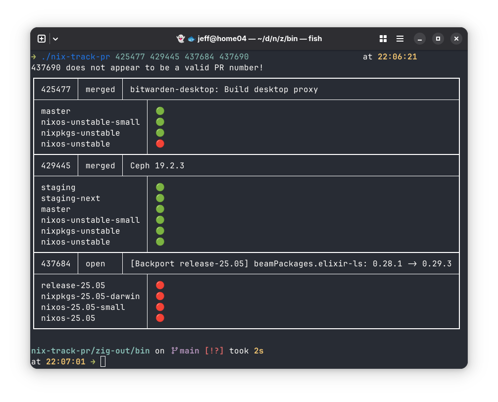

# nix-track-pr

A CLI tool for tracking the status of `nixpkgs` pull requests as they work their
way through the system to see which branches that they have been merged into.

Requires that `gh` and `git` be available. When first run, the program will
checkout a copy of the `nixpkgs` repository to a cache directory. This takes
around 6GB of disk space and many minutes to create on the first run. Subsequent
runs of the program will update the repository but that should not take very
long (depending on how long it has been since the last run).

## Cache Directory

`nix-track-pr` will create a cache directory to store the `nixpkgs` repository:

On anything but Windows (in order of preference):

- `$XDG_CACHE_DIR/nix-track-pr` if the `XDG_CACHE_DIR` directory environment variable is set.
- `~/.cache/nix-track-pr` if the `XDG_CACHE_DIR` is not set.

On Windows (in order of preference):

- `$XDG_CACHE_DIR/nix-track-pr` if the `XDG_CACHE_DIR` directory environment variable is set.
- `$LOCALAPPDATA/nix-track-pr`
